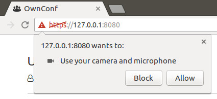

# OwnConf - WebRTC signalling application

We all have to communicate with our colleagues frequently, and making sure everyone has the same version of video-conferencing tool is a pain in the neck. IT Svit developed a simple service, based on Google Web RTC feature, allowing you to create a video-conferencing server in under 5 minutes and requiring no additional software aside of your Google Chrome or Mozilla Firefox browsers.

The admin creates the server and provides the link to it to other call participants. They simply open the link and can use the video and audio transmission, as well as a chat. Communicate with your friends and colleagues from the convenience of your browser!

## Install
1. Install requirements `pip install -r ./requirements.txt`

# Run web server
1. Run signalling & web servers `python -m signalling`.
2. Open `https://127.0.0.1:8080/` in your browser.
3. Type your name

   
4. Allow microphone/camera

   
5. Enjoy communication.